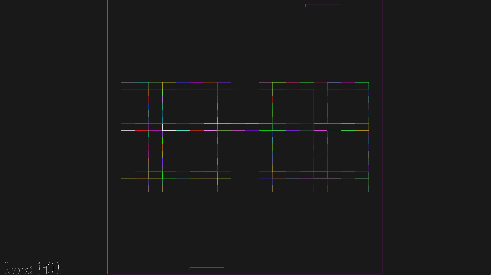

# BrickBreak Fever

**Author:** Angela Zhang

**Design:** BrickBreak is a fun classic game by itself, but what if we add... more? More paddles, more balls, more bricks, more fun!

**Networking:** Controls made by each client are sent along to the server, and the server handles converting those controls into updates of the game state (player position, ball position, collison handling) & sends all this information to each client.

**Screen Shot:**

**How To Play:**

A/D to move left and right and control the player, hit the ball back to clear as many blocks as you can

**Sources:** N/A

This game was built with [NEST](NEST.md).

